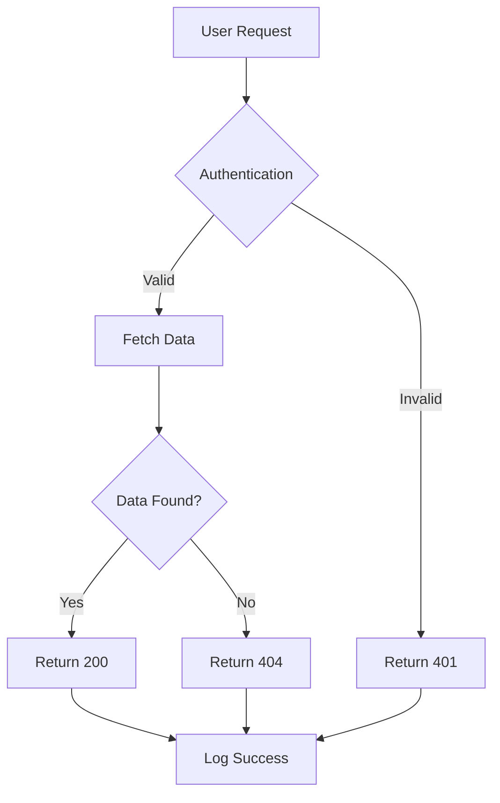
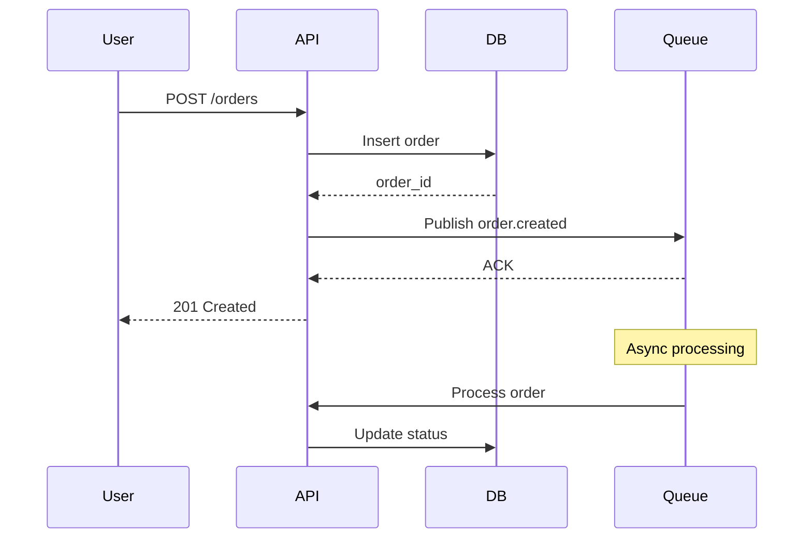
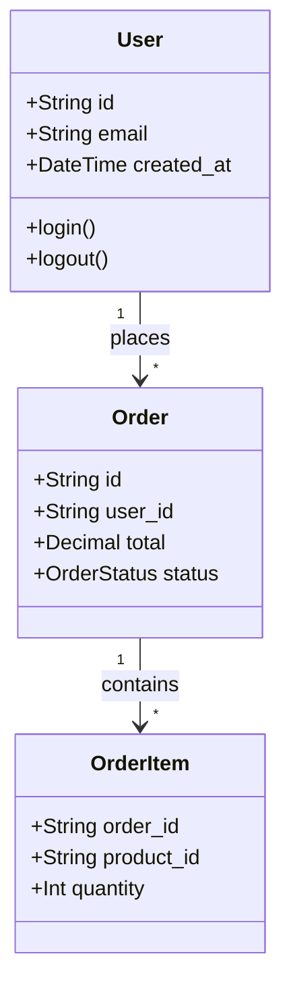
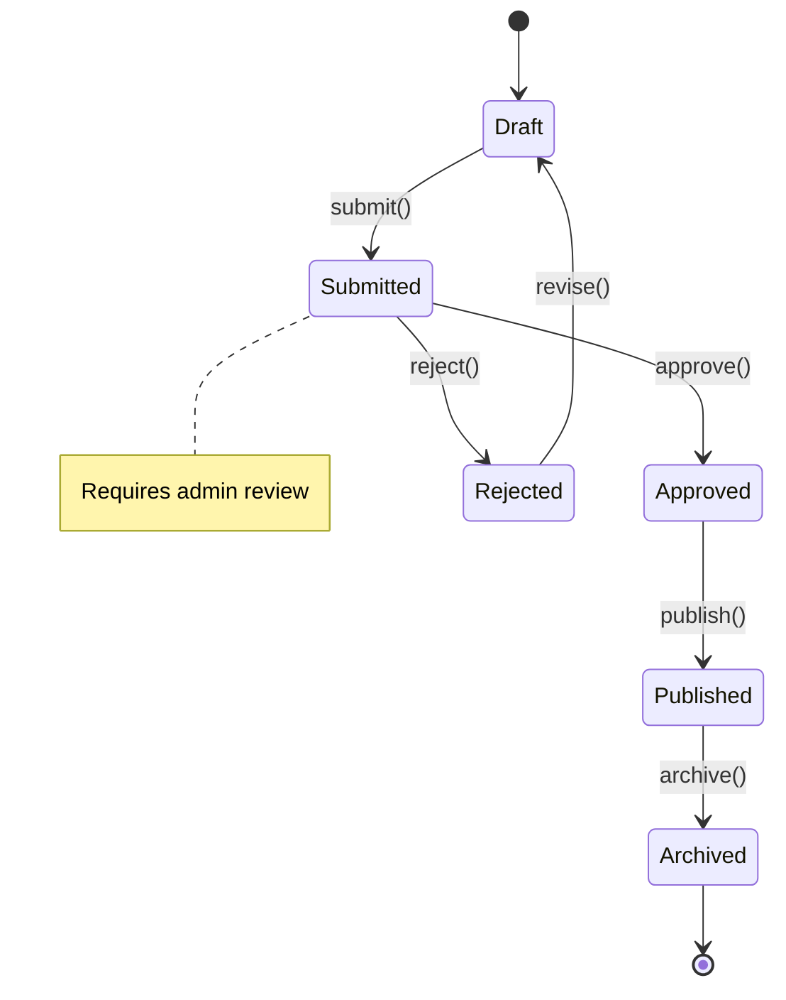
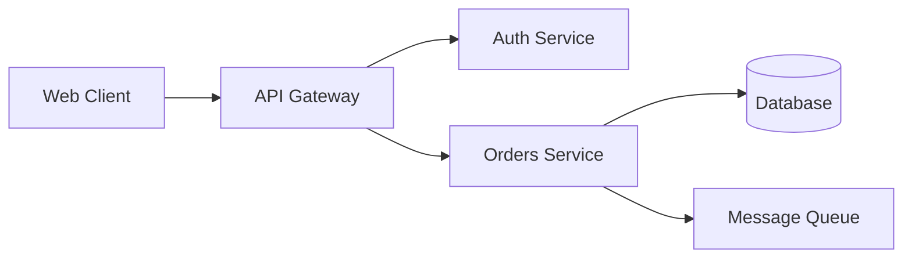
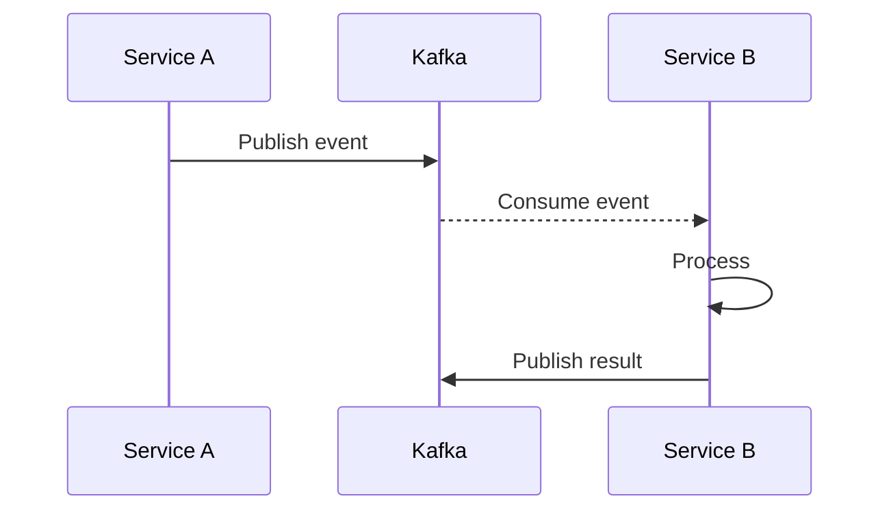
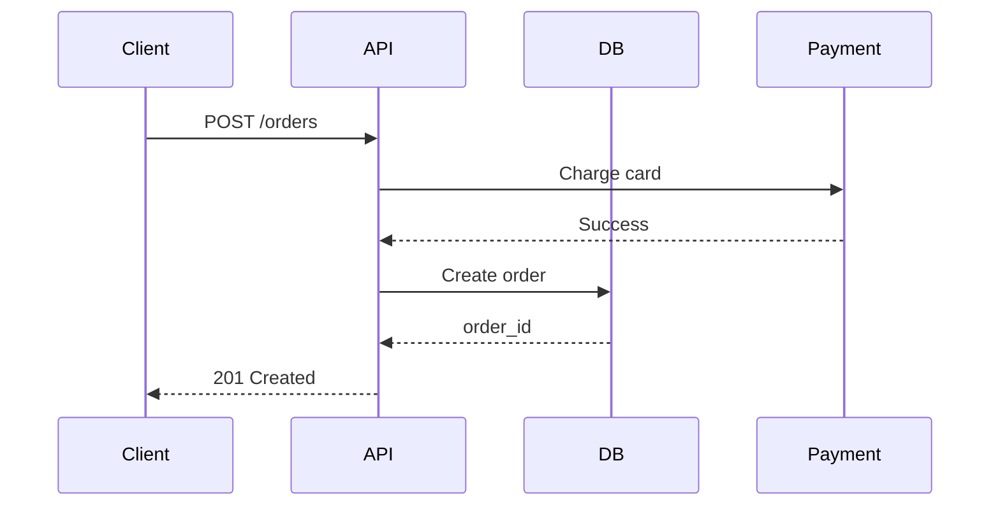
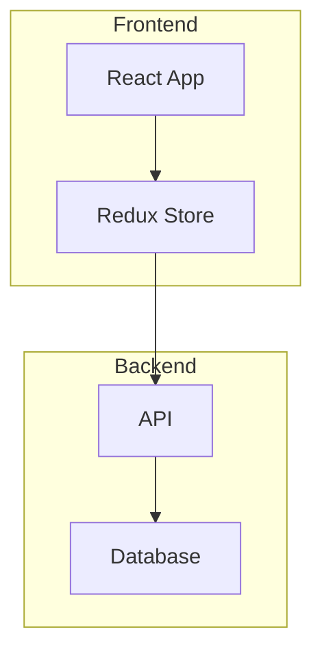
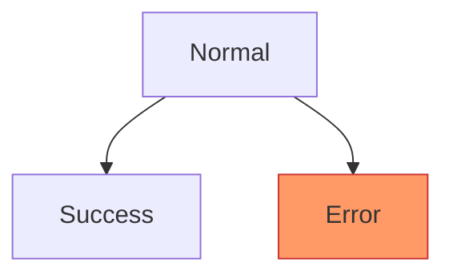

# AGENTS_MERMAID.md

Instructions for AI models using Mermaid diagrams in documentation and code.

Mermaid enables text-based diagrams in Markdown. Use it for architectural diagrams, workflows, data models, and system interactions.

**Target audience:** Technical documentation, ADRs, README files, design docs

## Documentation Structure with Mermaid

Organize diagrams with source control and documentation:

```
project-name/
├── docs/
│   ├── architecture/
│   │   ├── system-overview.md     # High-level architecture
│   │   ├── data-flow.md           # Data pipelines
│   │   └── diagrams/              # Standalone .mmd files (optional)
│   ├── decisions/                 # ADRs with diagrams
│   │   └── 0001-use-microservices.md
│   └── api/
│       └── sequence-diagrams.md   # API interaction flows
├── README.md                      # Project overview with architecture diagram
└── .claude/
    └── config.json                # MCP server configuration
```

**Guidelines:**

| Do | Don't |
|----|-------|
| Embed diagrams in Markdown (````mermaid` blocks) | Create separate image files |
| Keep diagrams in docs/ organized by type | Scatter diagrams across codebase |
| Version control .mmd source files | Generate images and commit them |
| Use consistent naming (lowercase-with-dashes.md) | Mix naming conventions |

## MCP Server Configuration

Configure Claude to render and generate Mermaid diagrams:

```json
{
  "mcpServers": {
    "mcp-mermaid": {
      "command": "npx",
      "args": ["-y", "mcp-mermaid"]
    }
  }
}
```

**Setup:**

1. Create `.claude/config.json` in project root
2. Add mcp-mermaid server configuration
3. Restart Claude Code to load MCP server
4. Use `@mcp-mermaid` in prompts to generate diagrams

**Verification:**

```bash
# Check MCP server is available
npx -y mcp-mermaid --help

# Test diagram rendering
echo 'graph TD; A-->B;' | npx -y mcp-mermaid
```

## Core Diagram Patterns

### Flowcharts (Process & Logic)

Use for: Workflows, decision trees, algorithm steps, process flows



**Syntax:**
- `graph TD` = top-down flow (use `LR` for left-right)
- `[]` = rectangular node, `{}` = decision diamond, `()` = rounded
- `-->` = arrow, `---|Label|` = labeled arrow

**Keep diagrams to 8-15 nodes.** Split complex flows into multiple diagrams.

### Sequence Diagrams (Interactions)

Use for: API calls, service communication, user flows, event sequences



**Patterns:**
- Solid arrow (`->>`) = synchronous call
- Dashed arrow (`-->>`) = response/callback
- Note boxes for context
- 4-6 participants maximum

### Class Diagrams (Data Models)

Use for: Database schemas, object models, domain entities, API structures



**Notation:**
- `+` = public, `-` = private, `#` = protected
- `"1"` and `"*"` = cardinality (one-to-many)
- List 3-5 key attributes (not all fields)

### State Diagrams (Lifecycle)

Use for: Object states, workflow stages, status transitions



**Use when:**
- Modeling order status, user lifecycle, document workflow
- Need to show all possible transitions
- States have clear entry/exit conditions

## Diagram Selection

| Use Case | Diagram Type | Complexity | Example |
|----------|-------------|-----------|---------|
| Algorithm logic | Flowchart | Simple | Login flow, data validation |
| Service interactions | Sequence | Medium | API request/response, event handling |
| Data relationships | Class | Medium | Database schema, domain model |
| Status transitions | State | Simple | Order lifecycle, approval workflow |
| System architecture | Flowchart (LR) | Complex | Microservices, infrastructure |
| Timeline/project | Gantt | Simple | Roadmap, sprint plan |
| Entity relationships | ER Diagram | Medium | Database design |

**Decision guide:**

- **"How does it work?"** → Flowchart
- **"Who talks to whom?"** → Sequence
- **"What's the structure?"** → Class
- **"What are the states?"** → State
- **"How is it organized?"** → Architecture (Flowchart LR)

## Integration Patterns

### In README Files

```markdown
# Project Name

## Architecture



The system uses a microservices architecture with...
```

**Place diagrams:**
- After heading, before explanatory text
- Use descriptive heading ("Architecture" not "Diagram")
- Keep to 1-2 diagrams per section

### In ADRs

```markdown
# ADR-0042: Migrate to Event-Driven Architecture

## Decision

We will use event-driven architecture with Kafka.

## Architecture


```

**Guidelines:**
- Place diagram in "Decision" or separate "Architecture" section
- Show before/after if migration
- Keep focused on the decision (not entire system)

### In API Documentation

```markdown
## POST /api/orders

### Request Flow


```

**Use for:**
- Complex multi-step flows
- Third-party integrations
- Error handling paths (add alt/opt blocks)

## Advanced Patterns

### Subgraphs (Grouping)



Use subgraphs to organize complex systems into logical groups (max 3-4 subgraphs).

### Styling (Sparingly)



**When to style:**
- Highlight errors (red) or success (green)
- Differentiate external systems
- Show critical paths

**Don't:** Over-style with custom colors (reduces clarity).

## Rendering Options

### In Markdown (Recommended)

```markdown

```

Renders in: GitHub, GitLab, VSCode (with extension), many documentation tools.

### As Standalone .mmd Files

```bash
# Create diagram file
echo 'graph TD; A-->B;' > diagram.mmd

# Render to SVG (requires mermaid-cli)
npx -y @mermaid-js/mermaid-cli -i diagram.mmd -o diagram.svg
```

**Use when:**
- Need SVG/PNG for presentations
- Diagram is >50 lines (too large for inline)
- Sharing outside Markdown context

### With MCP Server

```
User: "@mcp-mermaid create a sequence diagram showing OAuth flow"

Claude: [Uses MCP server to generate diagram]
```

**MCP benefits:**
- Real-time diagram generation
- Automatic syntax validation
- Preview before committing
- Iterative refinement

## Anti-Patterns

| Don't | Do |
|-------|-----|
| Create diagrams with 20+ nodes | Split into multiple focused diagrams (8-15 nodes) |
| Use images instead of Mermaid | Use text-based Mermaid (version controllable) |
| Add every implementation detail | Show high-level architecture (3-5 components) |
| Mix diagram types in one file | One diagram type per context |
| Skip labels on arrows | Label all relationships clearly |
| Use Mermaid for screenshots/mockups | Use Mermaid for logic/structure, not UI |
| Create diagrams without context | Add 1-2 sentence explanation before/after |
| Over-style with colors | Use default theme, style only for emphasis |
| Duplicate diagrams across docs | Reference central diagram or use includes |
| Forget to test rendering | Preview in GitHub/VSCode before committing |

## Quick Reference

| Aspect | Standard |
|--------|----------|
| MCP server | mcp-mermaid via npx |
| Diagram location | `docs/` organized by type |
| Max nodes per diagram | 8-15 nodes (split if more) |
| Max participants (sequence) | 4-6 |
| Arrow labels | Always label relationships |
| Syntax style | Follow official Mermaid docs |
| Rendering | In Markdown (GitHub/GitLab/VSCode) |
| File naming | lowercase-with-dashes.md |
| Version control | Commit .mmd source, not images |
| Testing | Preview before commit |

## When Using Mermaid Diagrams

1. Configure MCP server in `.claude/config.json` before starting
2. Choose diagram type based on use case (see decision guide table)
3. Keep diagrams to 8-15 nodes maximum (split complex flows)
4. Embed diagrams in Markdown with ````mermaid` code blocks
5. Label all arrows and relationships clearly
6. Add 1-2 sentence context before or after diagram
7. Use subgraphs to group related components (max 3-4 groups)
8. Test rendering in GitHub/VSCode before committing
9. Reference AGENTS_ADR.md for including diagrams in decision records
10. Use flowcharts for "how", sequence for "who/when", class for "what"

## See Also

- AGENTS_README.md for using diagrams in README files
- AGENTS_ADR.md for including diagrams in architectural decisions
- AGENTS_CLAUDE_MD.md for documenting diagram patterns in CLAUDE.md
- Official Mermaid documentation: https://mermaid.js.org/
