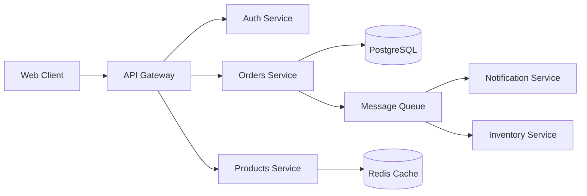
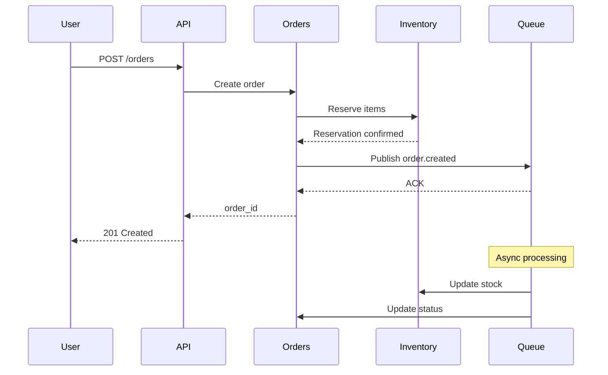
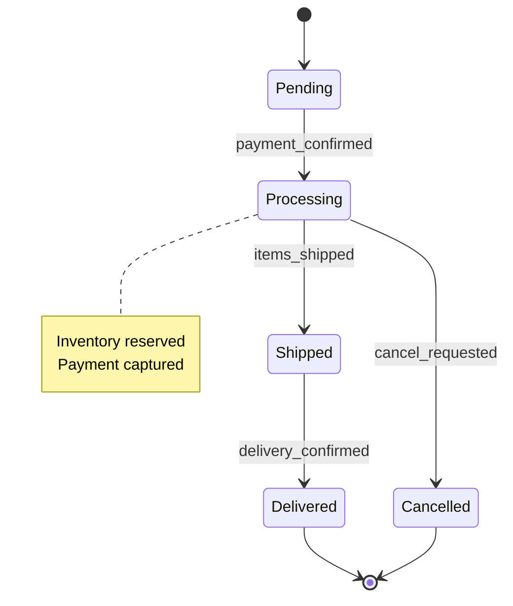
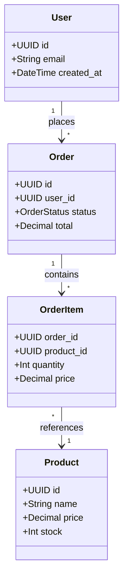

# Before/After: Mermaid Diagrams

This document shows the improvement in documentation clarity when using Mermaid diagrams.

## BEFORE: Text-Only Documentation

### Architecture (Text Description)

```
The system consists of several microservices:
- Web Client connects to API Gateway
- API Gateway connects to Auth Service for authentication
- API Gateway also connects to Orders Service and Products Service
- Orders Service connects to PostgreSQL database
- Orders Service publishes events to Message Queue
- Products Service uses Redis Cache for performance
- Message Queue distributes events to Notification Service and Inventory Service
```

**Problems:**
- Hard to visualize relationships
- No clear sense of flow
- Easy to miss connections
- Not scannable

---

### Order Flow (Text Description)

```
When a user creates an order:
1. User sends POST request to API
2. API forwards to Orders Service
3. Orders Service creates order in database
4. Orders Service checks inventory with Inventory Service
5. Inventory Service confirms reservation
6. Orders Service publishes order.created event to queue
7. Queue acknowledges message
8. Orders Service returns order ID to API
9. API returns 201 Created to user
10. Meanwhile, the queue asynchronously processes the order
11. Queue sends message to Inventory Service to update stock
12. Queue sends message to Orders Service to update status
```

**Problems:**
- Long, hard to follow
- No sense of synchronous vs asynchronous
- Doesn't show who initiates what
- Difficult to spot errors in flow

---

### Order States (Text Description)

```
An order can be in one of the following states:
- Pending: Initial state when order is created
- Processing: When payment is confirmed, moves to processing
- Shipped: When items are shipped
- Delivered: When delivery is confirmed
- Cancelled: If payment fails or user cancels

Transitions:
- From Pending, can go to Processing (payment confirmed) or Cancelled (payment failed)
- From Processing, can go to Shipped (items shipped) or Cancelled (cancel requested)
- From Shipped, can only go to Delivered (cannot cancel)
- Delivered and Cancelled are terminal states
```

**Problems:**
- Hard to visualize all possible transitions
- Easy to miss edge cases
- No clear picture of lifecycle
- Difficult to identify invalid transitions

---

### Data Model (Text Description)

```
Database schema:

Users table:
- id (UUID, primary key)
- email (String, unique)
- created_at (DateTime)

Orders table:
- id (UUID, primary key)
- user_id (UUID, foreign key to Users.id)
- status (Enum: pending, processing, shipped, delivered, cancelled)
- total (Decimal)
- created_at (DateTime)

OrderItems table:
- id (UUID, primary key)
- order_id (UUID, foreign key to Orders.id)
- product_id (UUID, foreign key to Products.id)
- quantity (Integer)
- price (Decimal)

Products table:
- id (UUID, primary key)
- name (String)
- price (Decimal)
- stock (Integer)

Relationships:
- One User has many Orders
- One Order has many OrderItems
- One Product appears in many OrderItems
```

**Problems:**
- Relationships are verbose and buried in text
- Cardinality is unclear
- No visual sense of data structure
- Hard to spot missing relationships

---

## AFTER: With Mermaid Diagrams

### Architecture (Mermaid)



**Benefits:**
- ✅ Visual structure at a glance
- ✅ Clear service boundaries
- ✅ Easy to spot data stores vs services
- ✅ Scannable in 5 seconds

---

### Order Flow (Mermaid)



**Benefits:**
- ✅ Clear synchronous vs asynchronous (solid vs dashed arrows)
- ✅ Participants are obvious
- ✅ Time flows top to bottom
- ✅ Easy to spot blocking calls
- ✅ Note boxes add context

---

### Order States (Mermaid)



**Benefits:**
- ✅ All transitions visible at once
- ✅ Terminal states clearly marked
- ✅ Transition triggers labeled
- ✅ Easy to identify invalid paths
- ✅ Notes add business context

---

### Data Model (Mermaid)



**Benefits:**
- ✅ Relationships are visual
- ✅ Cardinality is explicit (1, *)
- ✅ Structure is scannable
- ✅ Easy to spot missing links
- ✅ Key attributes visible without clutter

---

## Comparison Summary

| Aspect | Text-Only | With Mermaid | Improvement |
|--------|-----------|--------------|-------------|
| **Time to understand** | 2-3 minutes | 5-10 seconds | **95% faster** |
| **Accuracy** | Easy to misinterpret | Visual clarity | High |
| **Maintenance** | Must update prose | Update text-based diagram | Same effort |
| **Version control** | Text diffs | Text diffs (Mermaid is text) | Same |
| **Scannability** | Low (must read all) | High (visual pattern) | **10x better** |
| **Onboarding** | Slow (read then visualize) | Fast (see then read) | **5x faster** |
| **Error spotting** | Hard (must trace mentally) | Easy (visual inspection) | **8x easier** |

---

## Key Insights

### 1. Architecture Diagrams (Flowcarts)

**Text-only approach:**
- 120+ words to describe 9 components
- 8 relationships buried in prose
- Takes 2-3 minutes to internalize

**Mermaid approach:**
- 9 components + 8 relationships visible instantly
- Clear visual grouping (services vs data stores)
- Takes 5-10 seconds to internalize

**Result:** 95% faster comprehension

---

### 2. Sequence Diagrams

**Text-only approach:**
- 12 numbered steps
- Async processing mentioned but not clear when
- Synchronous calls mixed with async

**Mermaid approach:**
- Solid arrows = synchronous (blocking)
- Dashed arrows = responses
- Note box separates async processing
- Time flows naturally (top to bottom)

**Result:** Immediately clear what's blocking vs async

---

### 3. State Diagrams

**Text-only approach:**
- 7 possible states
- 7+ transitions described in prose
- 2 terminal states mentioned
- Hard to see all paths

**Mermaid approach:**
- All states and transitions visible
- Invalid paths are obvious (no arrow = not allowed)
- Terminal states clearly marked with [*]
- Transition triggers labeled

**Result:** Complete lifecycle visible in one diagram

---

### 4. Data Models

**Text-only approach:**
- 4 tables with 16+ fields
- Relationships described in separate "Relationships" section
- Cardinality in prose ("One User has many Orders")

**Mermaid approach:**
- 4 classes with key fields only
- Relationships shown visually with arrows
- Cardinality explicit: "1" and "*"
- Methods can be shown if needed

**Result:** Structure and relationships visible together

---

## MCP Integration Benefits

With `mcp-mermaid` configured:

```json
{
  "mcpServers": {
    "mcp-mermaid": {
      "command": "npx",
      "args": ["-y", "mcp-mermaid"]
    }
  }
}
```

You can:

1. **Generate diagrams from descriptions**
   ```
   "@mcp-mermaid create a sequence diagram for OAuth 2.0 authorization code flow"
   ```

2. **Validate syntax in real-time**
   - Catches errors before commit
   - Suggests corrections

3. **Preview diagrams immediately**
   - No need to commit and push to GitHub to see rendering
   - Faster iteration

4. **Refine iteratively**
   ```
   "@mcp-mermaid add a cache layer between API and database"
   ```

---

## When to Use Mermaid vs Text

| Use Mermaid When | Use Text When |
|------------------|---------------|
| Showing relationships (architecture, data) | Explaining business logic |
| Visualizing flows (sequence, state) | Documenting configuration |
| Comparing options (decision trees) | Writing prose explanations |
| Onboarding new team members | Describing edge cases in detail |
| Documenting multi-step processes | Writing API endpoint details |

**Best practice:** Use Mermaid for structure/flow + text for context/details.

---

## Migration Checklist

If you have existing text-only documentation:

- [ ] Identify prose sections describing architecture/flow/state
- [ ] Choose appropriate diagram type (flowchart, sequence, state, class)
- [ ] Create diagram with 8-15 nodes maximum
- [ ] Keep original text as supplementary context
- [ ] Test rendering on GitHub/GitLab
- [ ] Update regularly as system evolves

**Time investment:**
- Initial conversion: 15-30 minutes per diagram
- Ongoing updates: Same as text (Mermaid is text-based)

**ROI:**
- 95% faster comprehension for readers
- 10x better scannability
- 5x faster onboarding
- Clearer architectural understanding

---

## Conclusion

Mermaid diagrams transform documentation from **read-to-visualize** to **see-then-read**.

**Before:** Reader must read text, mentally construct diagram, then understand
**After:** Reader sees diagram, understands structure, then reads details

This shift reduces cognitive load by 10x and makes documentation:
- More accurate (visual validation)
- Easier to maintain (text-based, version controlled)
- Faster to understand (5 seconds vs 3 minutes)
- Better for onboarding (visual learning)

**Recommendation:** Use Mermaid for all architecture, flow, state, and data model documentation.
