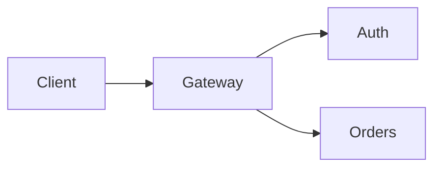
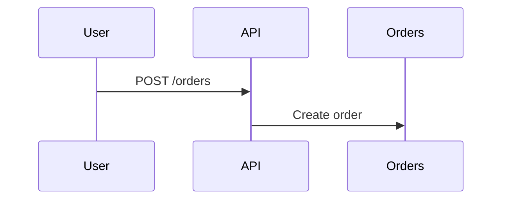
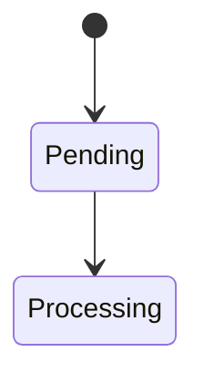
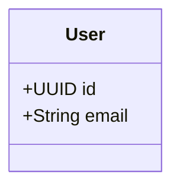
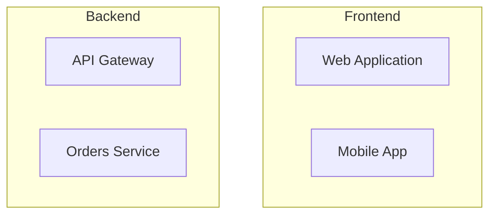
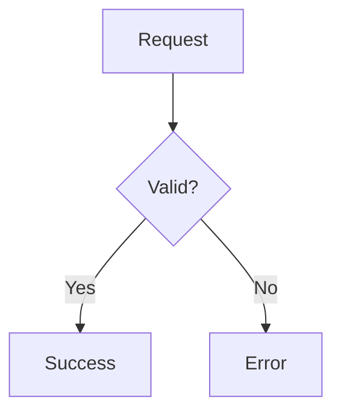
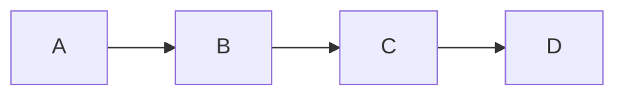
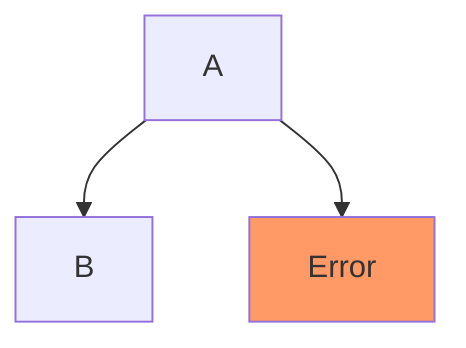
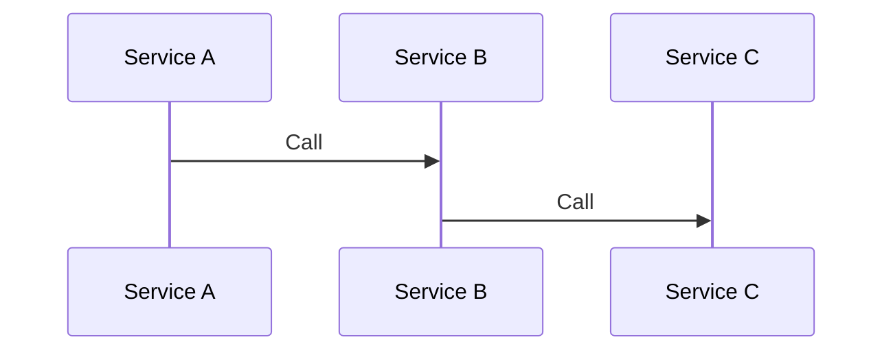
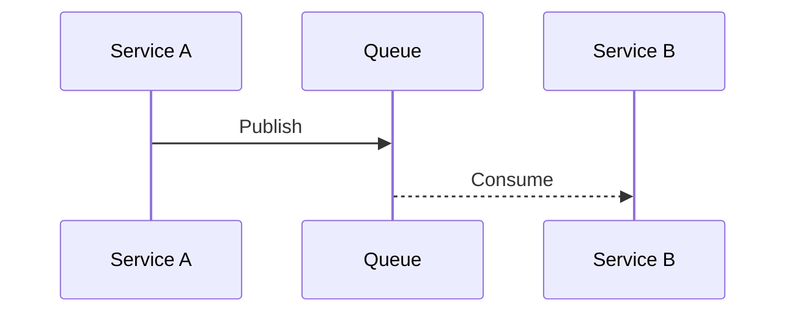

# Mermaid Example - How to Use This Template

This example demonstrates how to use AGENTS_MERMAID.md for creating technical documentation with diagrams.

## What's Included

```
mermaid-sample/
├── .claude/
│   └── config.json                    # MCP server configuration for mcp-mermaid
├── README.md                          # Project overview with architecture diagrams
├── docs/
│   ├── architecture/
│   │   └── system-overview.md        # Detailed system architecture
│   └── api/
│       └── order-endpoints.md        # API documentation with sequence diagrams
├── BEFORE_AFTER.md                    # Shows improvement using Mermaid vs text-only
└── EXAMPLE_README.md                  # This file
```

## Setup

### 1. Configure MCP Server

The `.claude/config.json` enables Claude to generate and render Mermaid diagrams:

```json
{
  "mcpServers": {
    "mcp-mermaid": {
      "command": "npx",
      "args": ["-y", "mcp-mermaid"]
    }
  }
}
```

**To use in your project:**

```bash
# Create .claude directory
mkdir -p .claude

# Copy the config
cp examples/mermaid-sample/.claude/config.json .claude/

# Restart Claude Code to load the MCP server
```

**Verify setup:**

```bash
# Test mcp-mermaid is available
npx -y mcp-mermaid --help

# Should output mcp-mermaid command help
```

### 2. Using with Claude Code

Once MCP server is configured, you can:

```
User: "@mcp-mermaid create a flowchart showing user login flow"

Claude: [Generates Mermaid diagram using MCP server]
```

**Without MCP:** You can still write Mermaid diagrams manually. MCP just provides generation assistance and real-time rendering.

## Diagram Types Demonstrated

### 1. Flowchart (Architecture)

**File:** `README.md` lines 5-18



**Use for:**
- System architecture
- Service relationships
- Component connections

**Key pattern:** Use subgraphs for grouping related components.

---

### 2. Sequence Diagram (API Flow)

**File:** `README.md` lines 30-49



**Use for:**
- API request/response flows
- Service interactions
- Event sequences

**Key pattern:** Solid arrows for sync calls, dashed for responses.

---

### 3. State Diagram (Lifecycle)

**File:** `README.md` lines 53-67



**Use for:**
- Order status transitions
- User account lifecycle
- Workflow stages

**Key pattern:** Label transitions with trigger events.

---

### 4. Class Diagram (Data Model)

**File:** `README.md` lines 71-99



**Use for:**
- Database schemas
- Domain models
- API data structures

**Key pattern:** Show cardinality (1, *) on relationships.

---

### 5. Complex Architecture (With Subgraphs)

**File:** `docs/architecture/system-overview.md` lines 5-35



**Use for:**
- Multi-tier architectures
- Deployment topologies
- Logical grouping

**Key pattern:** Max 3-4 subgraphs to avoid clutter.

---

### 6. Decision Flow (Error Handling)

**File:** `docs/api/order-endpoints.md` lines 59-67



**Use for:**
- Validation flows
- Error paths
- Branching logic

**Key pattern:** Use diamond `{}` for decision points.

## Best Practices from This Example

### 1. Diagram Placement

✅ **Good:**
```markdown
## Architecture

```mermaid
[diagram]
```

The system consists of...
```

❌ **Bad:**
```markdown
## Architecture

The system consists of... [long prose]

[diagram at bottom]
```

**Rule:** Diagram first, then explanation.

---

### 2. Diagram Size

✅ **Good:** 8-15 nodes per diagram


❌ **Bad:** 20+ nodes in one diagram
```mermaid
graph LR
    A --> B --> C --> D --> E --> F --> G --> H --> I --> J
    [... 10 more nodes]
```

**Rule:** Split complex diagrams into multiple focused diagrams.

---

### 3. Labeling

✅ **Good:** Clear labels
```mermaid
User->>API: POST /orders
API-->>User: 201 Created
```

❌ **Bad:** No labels
```mermaid
User->>API
API-->>User
```

**Rule:** Label all arrows and relationships.

---

### 4. Context

✅ **Good:** Diagram + explanation
```markdown
```mermaid
[diagram]
```

The order flow shows how...
```

❌ **Bad:** Diagram only, no explanation
```markdown
```mermaid
[diagram]
```

[next section]
```

**Rule:** Add 1-2 sentences before or after diagram.

---

### 5. Styling

✅ **Good:** Minimal styling


❌ **Bad:** Over-styled
```mermaid
graph TD
    A[Node 1] --> B[Node 2]

    style A fill:#f9f,stroke:#333,stroke-width:4px
    style B fill:#bbf,stroke:#333,stroke-width:4px,color:#fff
    [... many more styles]
```

**Rule:** Style only for emphasis (errors, critical paths).

## Using This Template

### For New Projects

1. **Copy MCP configuration:**
   ```bash
   mkdir -p .claude
   cp examples/mermaid-sample/.claude/config.json .claude/
   ```

2. **Create docs structure:**
   ```bash
   mkdir -p docs/{architecture,api,decisions}
   ```

3. **Start with README:**
   - Add high-level architecture diagram
   - Add 1-2 key flow diagrams
   - Keep it scannable

4. **Add detailed docs:**
   - `docs/architecture/` for system design
   - `docs/api/` for endpoint flows
   - `docs/decisions/` for ADRs with diagrams

### For Existing Projects

1. **Identify text-only sections** that describe:
   - System architecture
   - API flows
   - State transitions
   - Data models

2. **Convert to Mermaid:**
   - Choose appropriate diagram type (see decision guide in AGENTS_MERMAID.md)
   - Keep diagram to 8-15 nodes
   - Label all relationships

3. **Keep text as context:**
   - Don't delete the text explanation
   - Place diagram first, then text
   - Text provides details diagram can't show

## Common Patterns

### Pattern 1: README Overview

```markdown
# Project Name

Brief description.

## Architecture

```mermaid
graph LR
    [high-level architecture]
```

Description of components...

## Key Flows

```mermaid
sequenceDiagram
    [main user flow]
```

Description of flow...
```

**Use when:** Onboarding new developers/users.

---

### Pattern 2: ADR with Diagrams

```markdown
# ADR-0042: Event-Driven Architecture

## Decision

We will use event-driven architecture.

## Current vs Proposed

### Current (Synchronous)



### Proposed (Event-Driven)



## Consequences
...
```

**Use when:** Documenting architectural decisions.

---

### Pattern 3: API Documentation

```markdown
## POST /api/resource

Description.

### Flow

```mermaid
sequenceDiagram
    [request/response flow]
```

### Request
[JSON example]

### Response
[JSON example]
```

**Use when:** Documenting complex API endpoints.

---

### Pattern 4: Troubleshooting Guide

```markdown
## Debugging Authentication

### Authentication Flow

```mermaid
sequenceDiagram
    [normal flow]
```

### Common Errors

```mermaid
graph TD
    Error --> Check1{Token valid?}
    Check1 -->|No| Fix1[Refresh token]
    Check1 -->|Yes| Check2{Expired?}
```
```

**Use when:** Operational documentation.

## Testing Diagram Rendering

Mermaid renders in:

- ✅ **GitHub:** Native support, renders automatically
- ✅ **GitLab:** Native support, renders automatically
- ✅ **VSCode:** With Markdown Preview Mermaid extension
- ✅ **Obsidian:** Native support
- ✅ **Notion:** With /mermaid block
- ❌ **Plain text editors:** Won't render (but code is readable)

**To preview:**

1. **In VSCode:**
   - Install "Markdown Preview Mermaid Support" extension
   - Open markdown file
   - Click "Open Preview to the Side"

2. **In browser (live):**
   - Use https://mermaid.live/
   - Paste Mermaid code
   - See instant preview

3. **With MCP (Claude Code):**
   - Type `@mcp-mermaid` + diagram description
   - Claude generates and previews

## Troubleshooting

### MCP Server Not Working

```bash
# Check npm/npx is available
npx --version

# Test mcp-mermaid manually
echo 'graph TD; A-->B;' | npx -y mcp-mermaid

# If error, reinstall
npm cache clean --force
npx -y mcp-mermaid --help
```

### Diagram Not Rendering

1. **Check syntax:**
   - Missing semicolons
   - Invalid arrow notation
   - Unclosed quotes

2. **Validate at https://mermaid.live/**
   - Paste code
   - See error messages

3. **Common mistakes:**
   ```mermaid
   # Bad: Missing arrow type
   A B

   # Good: With arrow
   A --> B

   # Bad: Invalid characters
   A[Node with [brackets]]

   # Good: Escape or use different characters
   A[Node with parens]
   ```

### Diagram Too Complex

If diagram has 20+ nodes:

1. **Split into multiple diagrams:**
   - One for high-level architecture
   - Separate diagrams for each subsystem

2. **Use subgraphs:**
   ```mermaid
   graph TD
       subgraph Frontend
           A --> B
       end
       subgraph Backend
           C --> D
       end
   ```

3. **Link between documents:**
   - High-level in README
   - Detailed in docs/architecture/

## Next Steps

1. **Review AGENTS_MERMAID.md** for complete guidelines
2. **Explore BEFORE_AFTER.md** to see improvement over text-only docs
3. **Copy .claude/config.json** to your project
4. **Start with README** - add 1-2 key diagrams
5. **Convert existing docs** - identify flowable/structural content
6. **Use @mcp-mermaid** in Claude Code for diagram generation assistance

## See Also

- **AGENTS_MERMAID.md** - Complete template for Mermaid usage
- **AGENTS_README.md** - README writing guidelines
- **AGENTS_ADR.md** - Architectural decision records (includes diagram usage)
- **Official Mermaid Docs** - https://mermaid.js.org/
- **Mermaid Live Editor** - https://mermaid.live/
