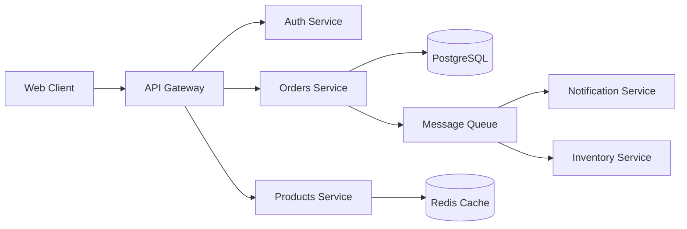
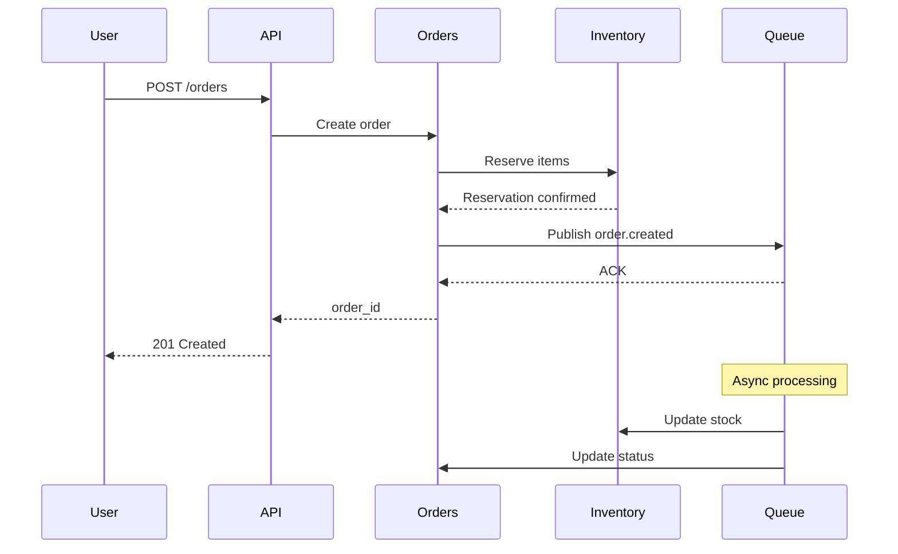
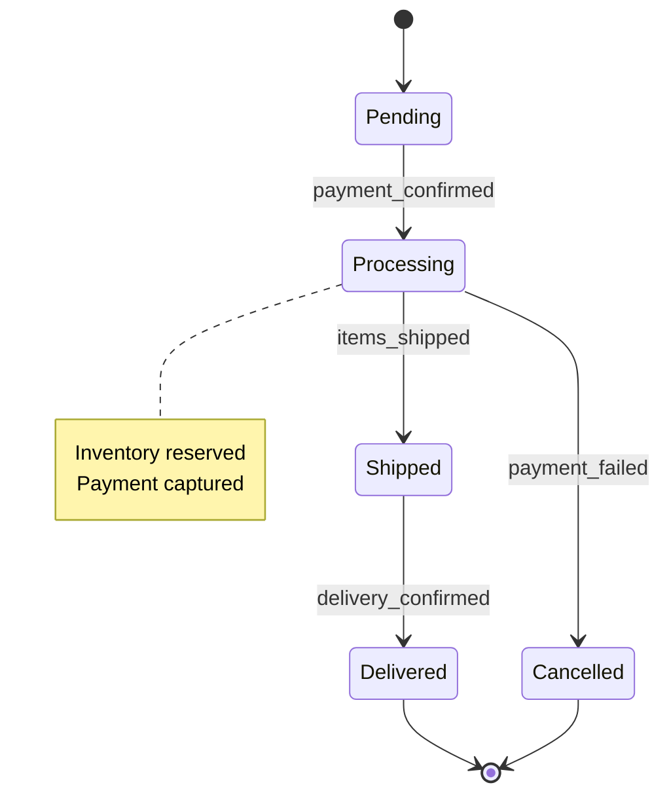
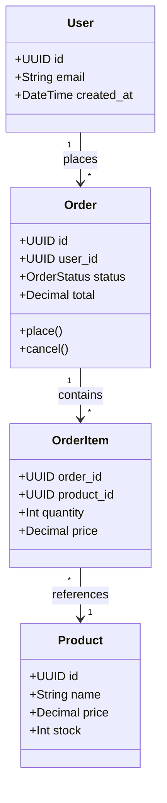

# E-Commerce Order System

A microservices-based order management system with event-driven architecture.

## Architecture



The system consists of five core services:

- **Auth Service**: Handles user authentication and authorization
- **Orders Service**: Manages order lifecycle and state transitions
- **Products Service**: Catalog management with Redis caching
- **Notification Service**: Sends emails/SMS based on order events
- **Inventory Service**: Tracks stock levels and reservations

## Order Flow

When a user places an order:



## Order States



## Data Model



## Getting Started

```bash
# Install dependencies
npm install

# Start services
docker-compose up -d

# Run migrations
npm run migrate

# Start API gateway
npm start
```

## API Endpoints

See [API Documentation](docs/api/endpoints.md) for detailed endpoint descriptions and sequence diagrams.

## Architecture Decisions

See [ADRs](docs/decisions/) for architectural decision records with detailed diagrams.

## License

MIT
