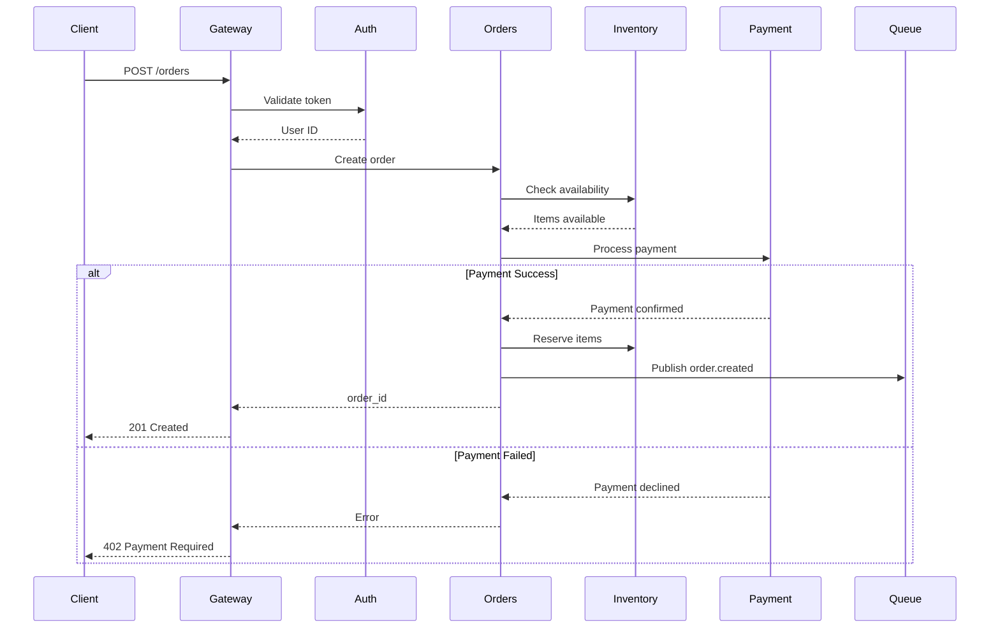
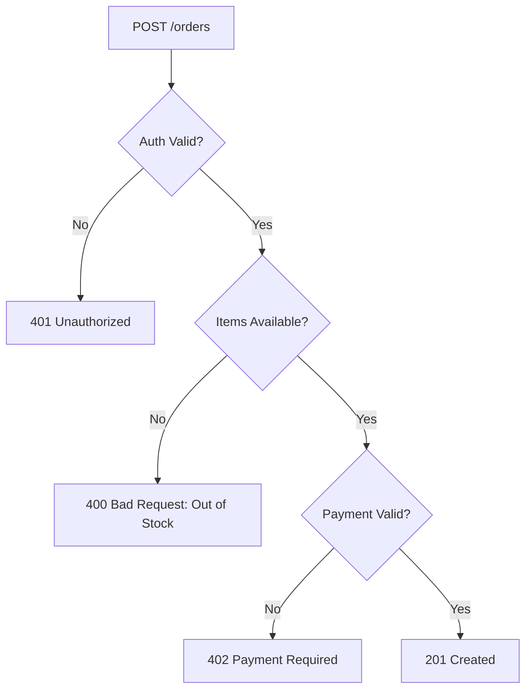
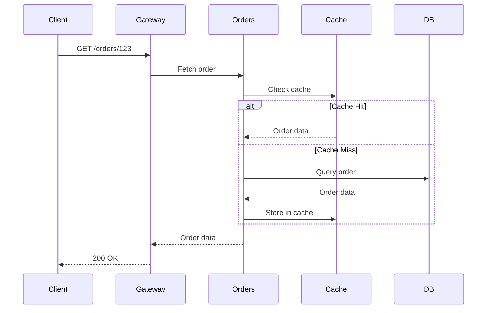
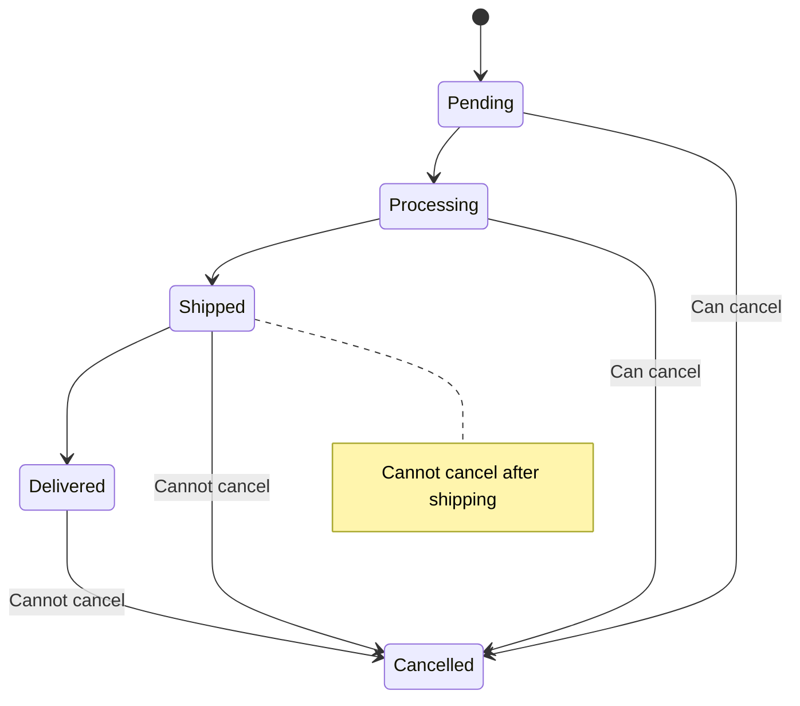
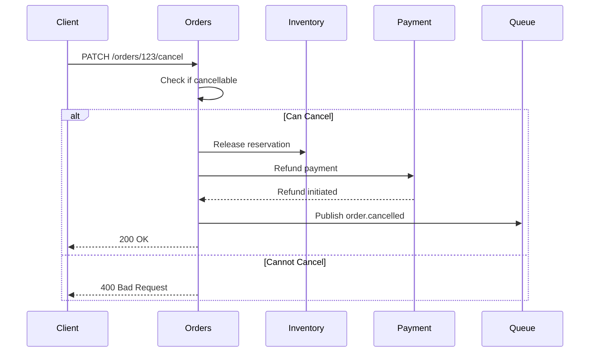
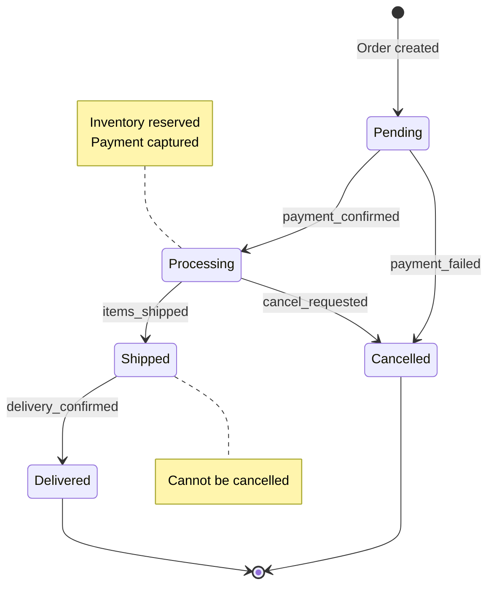
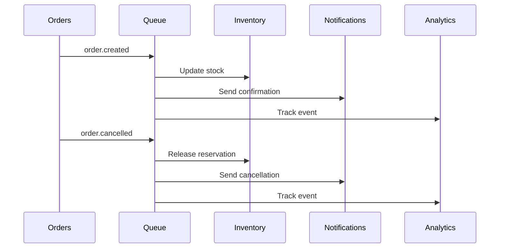
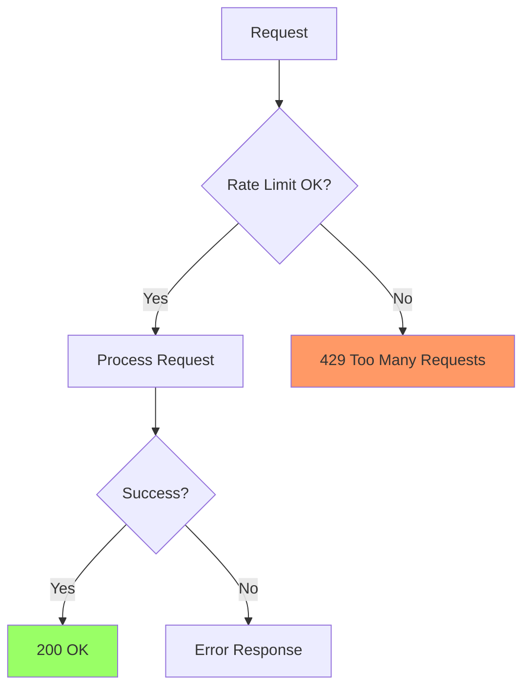

# Order API Endpoints

## POST /api/orders

Create a new order.

### Request Flow



### Request

```json
POST /api/orders
Authorization: Bearer <token>

{
  "items": [
    {
      "product_id": "prod_123",
      "quantity": 2
    }
  ],
  "shipping_address": {
    "street": "123 Main St",
    "city": "San Francisco",
    "postal_code": "94102"
  },
  "payment_method": "card_xyz"
}
```

### Response

```json
201 Created

{
  "order_id": "ord_456",
  "status": "pending",
  "total": 99.98,
  "created_at": "2024-01-15T10:30:00Z"
}
```

### Error Responses



## GET /api/orders/:id

Retrieve order details.

### Request Flow



### Response

```json
200 OK

{
  "order_id": "ord_456",
  "user_id": "usr_789",
  "status": "processing",
  "items": [
    {
      "product_id": "prod_123",
      "quantity": 2,
      "price": 49.99
    }
  ],
  "total": 99.98,
  "created_at": "2024-01-15T10:30:00Z",
  "updated_at": "2024-01-15T10:35:00Z"
}
```

## PATCH /api/orders/:id/cancel

Cancel an order.

### Cancellation Rules



### Request Flow



## PUT /api/orders/:id/status

Update order status (Admin only).

### Status Transitions



### Request

```json
PUT /api/orders/123/status
Authorization: Bearer <admin_token>

{
  "status": "shipped",
  "tracking_number": "TRK123456",
  "carrier": "UPS"
}
```

## Webhook Events

Orders service publishes events for async processing:



### Event Types

| Event | Description | Consumers |
|-------|-------------|-----------|
| order.created | New order placed | Inventory, Notifications, Analytics |
| order.cancelled | Order cancelled | Inventory, Notifications, Analytics |
| order.shipped | Order shipped | Notifications, Analytics |
| order.delivered | Order delivered | Notifications, Analytics |

## Rate Limiting



Limits per user:
- 100 requests/minute for authenticated users
- 10 requests/minute for unauthenticated users

## Error Codes

| Code | Description | Example |
|------|-------------|---------|
| 400 | Bad Request | Invalid order items, out of stock |
| 401 | Unauthorized | Missing or invalid token |
| 402 | Payment Required | Payment declined |
| 404 | Not Found | Order does not exist |
| 409 | Conflict | Order already cancelled |
| 429 | Too Many Requests | Rate limit exceeded |
| 500 | Internal Server Error | Database connection failed |

## See Also

- [System Architecture](../architecture/system-overview.md) for high-level design
- [ADR-0002: RESTful API Design](../decisions/0002-restful-api.md) for API principles
- [Error Handling Guide](error-handling.md) for error response formats
