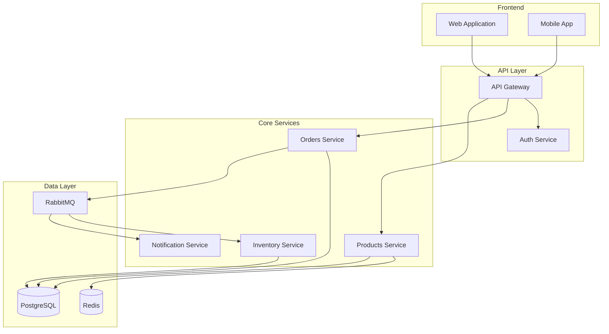
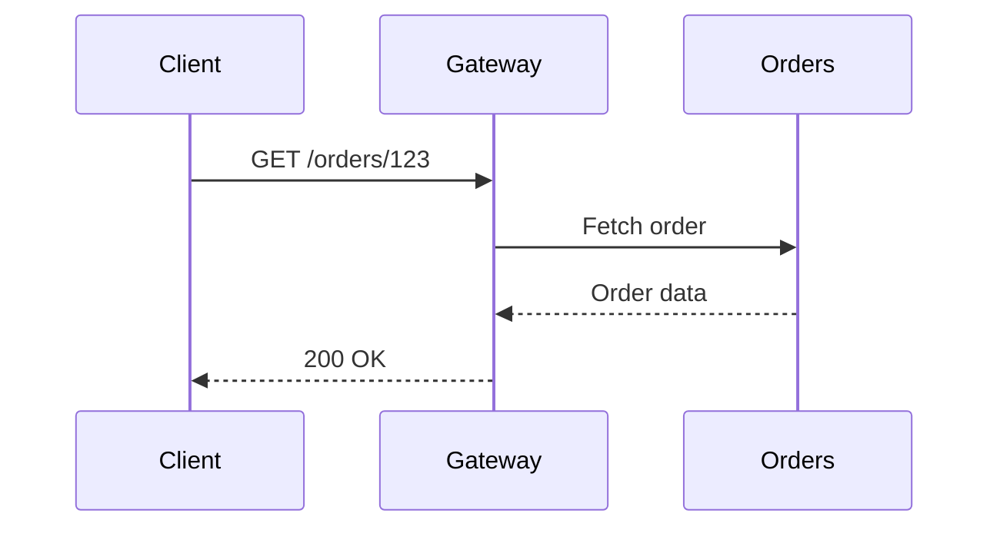
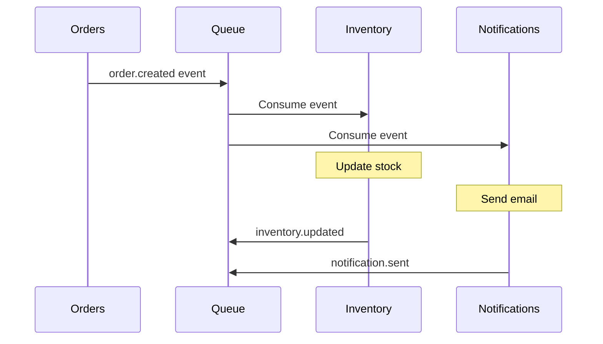
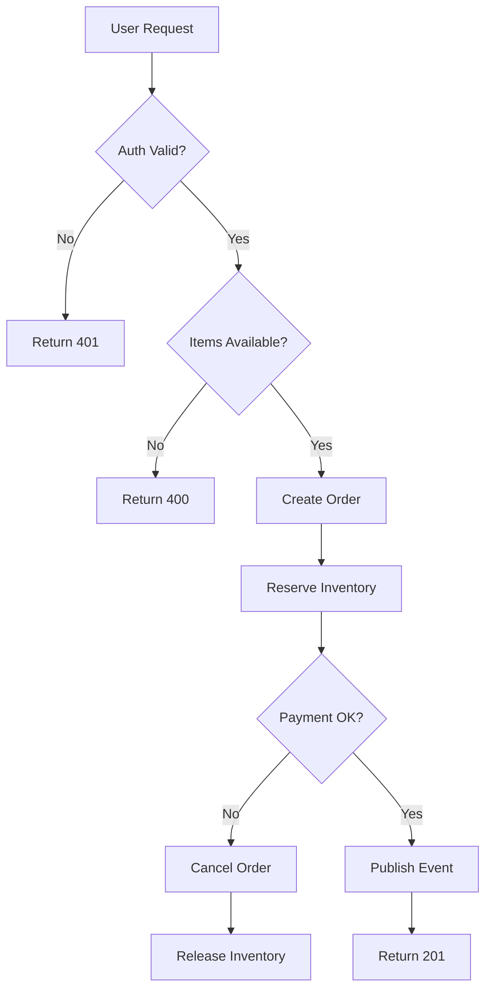
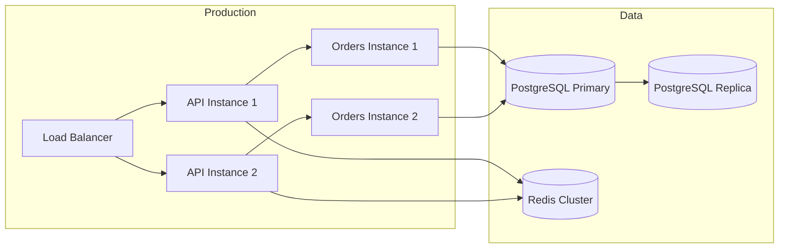
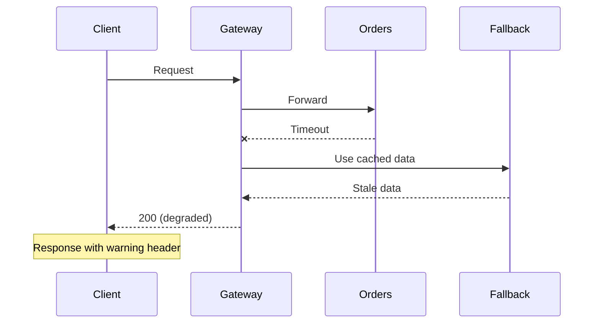
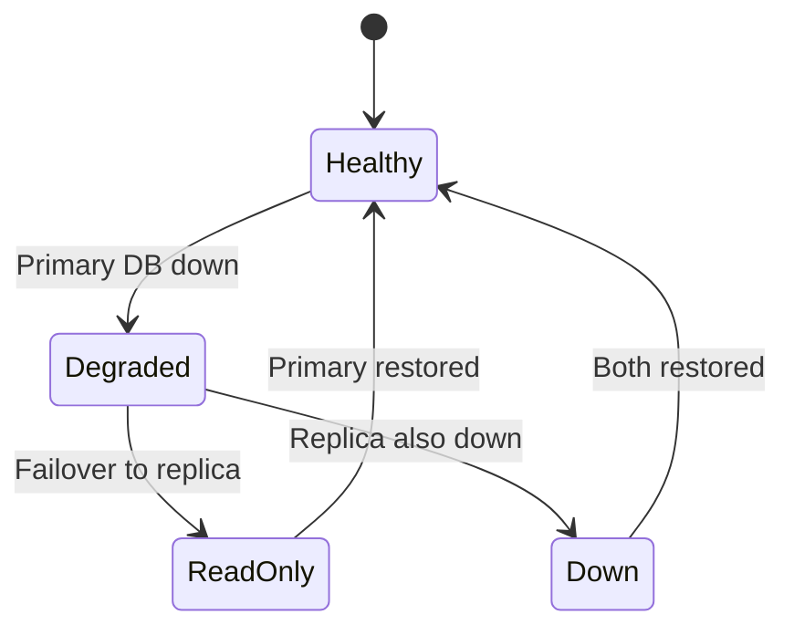
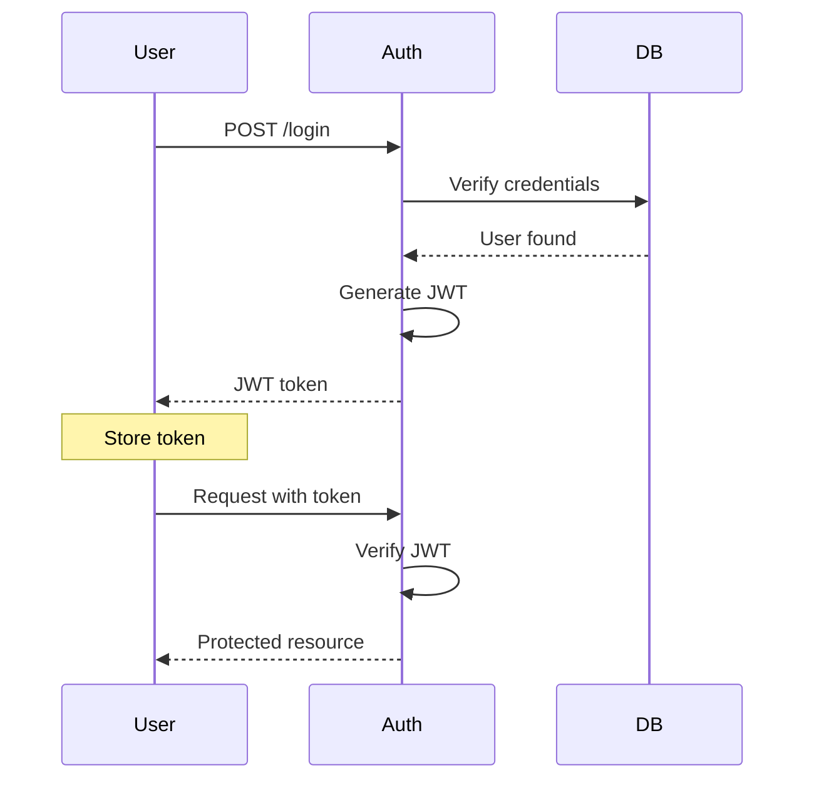

# System Architecture Overview

This document describes the high-level architecture of the E-Commerce Order System.

## System Components

## Service Communication Patterns

### Synchronous (REST)

Used for: User-facing operations requiring immediate response

### Asynchronous (Message Queue)

Used for: Background processing, service decoupling

## Data Flow

### Order Creation Flow

## Deployment Architecture

## Scaling Strategy

| Component | Strategy | Max Load |
|-----------|----------|----------|
| API Gateway | Horizontal (auto-scale) | 10K req/sec |
| Orders Service | Horizontal (stateless) | 5K orders/sec |
| Database | Vertical + read replicas | 50K queries/sec |
| Message Queue | Clustered (3 nodes) | 100K msgs/sec |
| Cache | Redis Cluster (6 nodes) | 500K ops/sec |

## Failure Scenarios

### Service Outage

### Database Failure

## Monitoring

Key metrics tracked:

- Request latency (p50, p95, p99)
- Error rates per service
- Queue depth and lag
- Database connection pool usage
- Cache hit rates

See [Monitoring Dashboard](../operations/monitoring.md) for details.

## Security

### Authentication Flow

## Next Steps

- Review [API Documentation](../api/endpoints.md) for detailed endpoint specs
- See [ADR-0001](../decisions/0001-event-driven-architecture.md) for architecture rationale
- Check [Deployment Guide](../operations/deployment.md) for infrastructure setup
